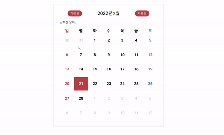

# 1. 달력 살펴보기 🔎

<p align=center style="color:#b9b9b9">프로젝트 기간 2021.06.20</p>

### 🔥 서비스 소개

 <h4>Date API를 통해서 달력을 보여주는 웹 사이트입니다.</h4>

### 💻 기술 스택

- `Javascript`
- `HTML5`
- `CSS3`

> #### ⚙ 프로젝트 실행 해보기

```js
git clone https://github.com/dnr14/calendar.git
cd calendar
npm -g i serve
serve -s .
```

> #### 👨‍💻 구현화면

- [체험하기](https://dnr14.github.io/calendar)

<div align=center>
  
</div>

<br>

### 🔥 기능 설명

1. Date getFullYear,getMonth 함수를 이용하여 오늘이 몇 월 며칠인지 알려줍니다.

```js
this.today = new Date();
this.currentYear = this.today.getFullYear();
this.currentMonth = this.today.getMonth();
```

2. 해당 월의 시작 일, 끝나는 일을 계산해서 월 단위로 달력을 그려줍니다.

```js
// ex 5월 index = 4 로 표기 된다.
this.startDate = new Date(this.currentYear, this.currentMonth, 1);
// 0은 하루를 뺀다.
// 5월 1일 ~ 5월 31일을 원하면 6월 1일로 만든 후 0을 넣어서 하루를 빼준다.
this.endDate = new Date(this.currentYear, this.currentMonth + 1, 0);
```

3. 현재 달의 시작 요일만큼 빼서 이전 달의 일 수를 가져와서 그려줍니다.

```js
prevDraw(startObj) {
    // DATE API는 0~6으로 일~월을 알려줍니다.
    const day = startObj.getDay();
    // Date의 3번째 파라미터에 음수를 준다면 가져오는 날짜에서 그 수만큼 뺀 날짜를 돌려줍니다.
    const prevDate = new Date(this.currentYear, this.currentMonth, -day + 1);

    for (let i = 0; i < day; i++) {
      this.$row.append(
        this.makeSpan(`${prevDate.getDate() + i}`, ["date", "space"])
      );
    }
  }
```

4. 현재 달의 끝나는 요일만큼 빼서 다음 달의 일 수를 가져와서 그려줍니다.

```js
nextDraw(endObj) {
  const nextDate = new Date(this.currentYear, this.currentMonth + 1, 1);
  for (let i = 0; i < 6 - endObj.getDay() + 7; i++) {
    this.$row.append(
      this.makeSpan(`${nextDate.getDate() + i}`, ["date", "space"])
    );
  }
}
```
